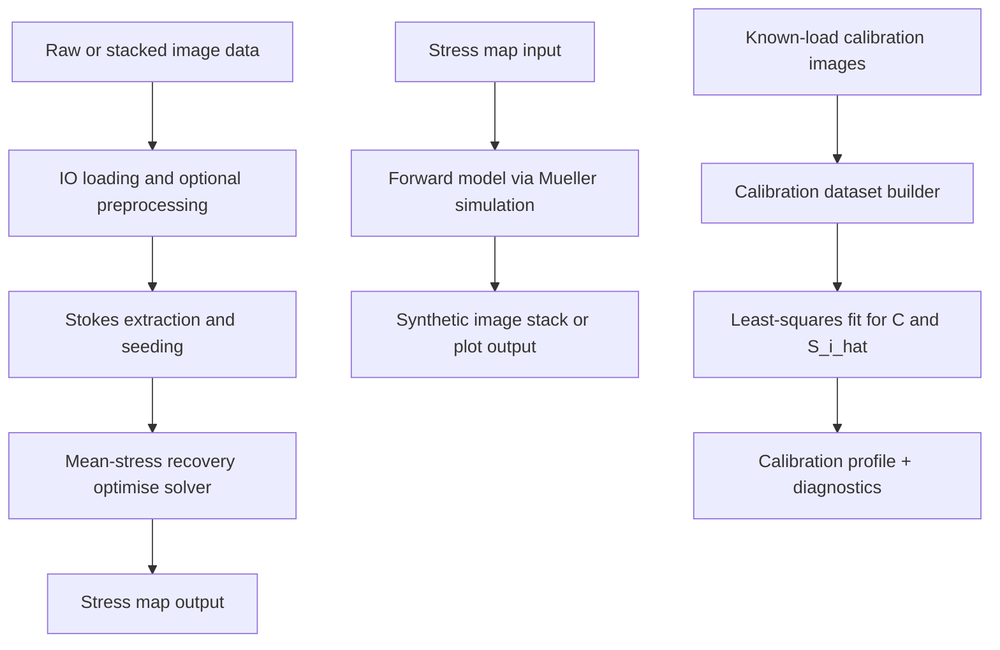

# Architecture

## High-Level Pipelines

## Main Runtime Paths

- `image-to-stress` (`photoelastimetry.main:image_to_stress`)
  - load image stack (`io`)
  - apply optional calibration blank correction (`calibrate`)
  - run phase-decomposed seeding (`seeding`)
  - recover mean stress (`optimise`)
  - save `[H, W, 3]` stress map (`io`)
- `stress-to-image` (`photoelastimetry.main:stress_to_image`)
  - load stress map (`io`)
  - parse aliases / fallback params
  - simulate multi-wavelength polarimetry (`image`)
  - save stack or plot (`io`, `plotting`)
- `calibrate-photoelastimetry` (`photoelastimetry.main:cli_calibrate`)
  - validate config + build dataset (`calibrate`)
  - robust least-squares fit (`scipy.optimize.least_squares`)
  - write profile/report/diagnostics

## Data Shapes

- Stress map: `[H, W, 3]`
- Polarimetric image stack: `[H, W, n_wavelengths, 4]`
- Demosaiced raw output path in `main.py`: TIFF exported as `TCYX` for compatibility

## Key Design Decisions

- Inversion path uses one solver route: optimise mean-stress recovery.
- Calibration profile can backfill inversion/forward-model optical parameters.
- Legacy aliases are still accepted where explicitly implemented in `main.py`.
